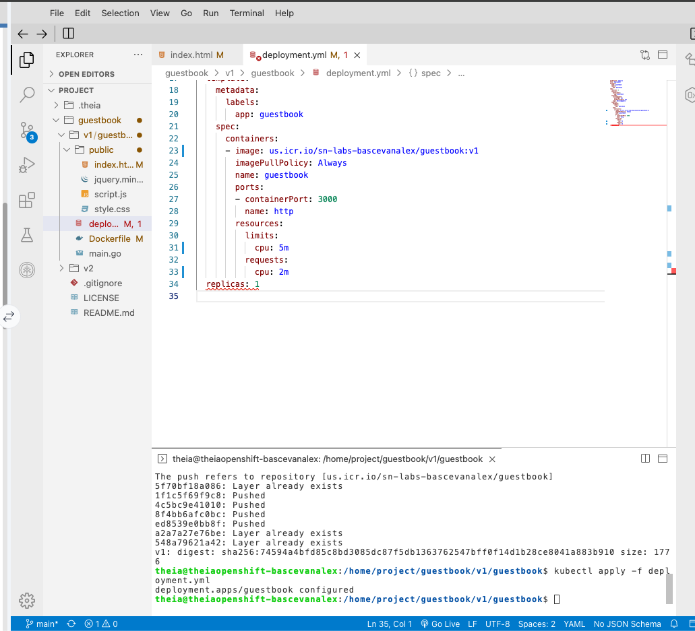
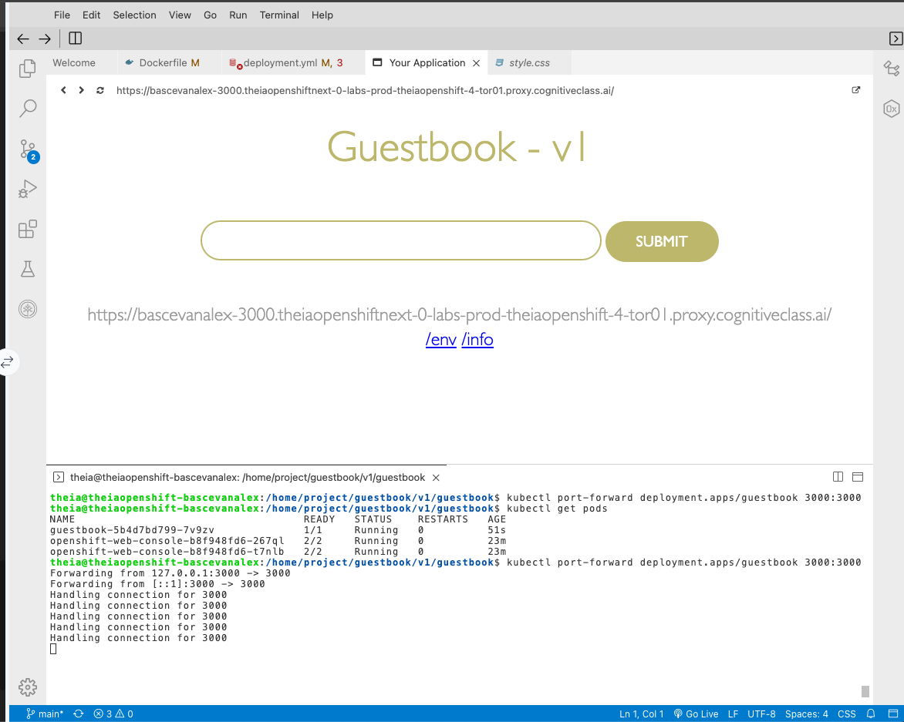

# Build-and-Deploy-a-Guestbook-App
Guestbook app deployed OpenShift and Kubernetes. IBM Final Project.

## -Final-Project--Build-and-Deploy-a-Guestbook-App

In this final project of Introduction to Containers w/ Docker, Kubernetes & OpenShift , you will build and deploy a simple guestbook application. The application consists of a web front end which will have a text input where you can enter any text and submit. For all of these we will create Kubernetes Deployments and Pods. Then we will apply Horizontal Pod Scaling to the Guestbook application and finally work on Rolling Updates and Rollbacks.

## -Skills:
OpenShit/Istio · Docker · IBM Cloud · Kubernetes . DevOps

####  Build the guestbook app
1. Complete the Dockerfile with the necessary Docker commands to build and push your image. The path to this file is `guestbook/v1/guestbook/Dockerfile`

2. Export your namespace as an environment variable so that it can be used in subsequent commands.
3. Build the guestbook app using the Docker Build command.
4. Push the image to IBM Cloud Container Registry.
5. Verify that the image was pushed successfully.
6. Open the deployment.yml file in the v1/guestbook directory & view the code for the deployment of the application.
7. Apply the deployment using Kubernetes descriptive command from .yml file
8. Open a New Terminal and enter command to view your application.
9. Launch your application on port 3000.
10. Now you should be able to see your running application. Please copy the app URL which will be given.
11. Try out the guestbook by putting in a few entries. You should see them appear above the input box after you hit Submit.

####  Solution 
1. 
        FROM golang:1.15 as builder
        RUN go get github.com/codegangsta/negroni
        RUN go get github.com/gorilla/mux github.com/xyproto/simpleredis
        COPY main.go .
        RUN go build main.go

        FROM ubuntu:18.04

        COPY --from=builder /go//main /app/guestbook
        COPY public/index.html /app/public/index.html
        COPY public/script.js /app/public/script.js
        COPY public/style.css /app/public/style.css
        COPY public/jquery.min.js /app/public/jquery.min.js

        WORKDIR /app
        CMD ["./guestbook"]
        EXPOSE 3000

2. 
       export MY_NAMESPACE=sn-labs-$USERNAME

3. 
        docker build . -t us.icr.io/$MY_NAMESPACE/guestbook:v1

4. 
        ibmcloud cr login
        ibmcloud cr region-set us-south
        docker push us.icr.io/$MY_NAMESPACE/guestbook:v1

5. 
       ibmcloud cr images

6. 
  

7. 
       kubectl apply -f deployment.yml

8. 
        kubectl port-forward deployment.apps/guestbook 3000:3000

10. 
    
####  Autoscale the Guestbook application using Horizontal Pod Autoscaler
1. Autoscale the Guestbook deployment using `kubectl autoscale deployment`
2. Check the current status of the newly-made HorizontalPodAutoscaler
3. Open another new terminal and enter command to generate load on the app to observe the autoscaling (Please ensure your port-forward command is running. In case you have stopped your application, please run the port-forward command to re-run the application at port 3000.)
4. Run command to observe the replicas increase in accordance with the autoscaling.
5. Run the above command again after 5-10 minutes and you will see an increase in the number of replicas which shows that your application has been autoscaled.
6. Run command to observe the details of the horizontal pod autoscaler.
  
#### Solution
1. 
        kubectl autoscale deploy guestbook --min=2 --max=10 --cpu-percent=10
2. 
        kubectl get hpa guestbook

3. 
        kubectl run -i --tty load-generator --rm --image=busybox:1.36.0 --restart=Never -- /bin/sh -c "while sleep 0.01; do wget -q -O- [<your app URL>](https://zakizaja-3000.theiaopenshift-0-labs-prod-theiaopenshift-4-tor01.proxy.cognitiveclass.ai/); done"

4. 
        kubectl get hpa guestbook --watch

6. 
        kubectl get hpa guestbook

#### Perform Rolling Updates and Rollbacks on the Guestbook application
1. Please update the title and header in index.html to any other suitable title and header like <Your name> Guestbook - v2 & Guestbook - v2.
2. Update the values of the CPU in the deployment.yml to cpu: 5m and cpu: 2m 
3. Apply the changes to the deployment.yml file.
4. Open a new terminal and run the port-forward command again to start the app.
5. Launch your application on port 3000. Click on the Skills Network button on the right, it will open the “Skills Network Toolbox”. Then click the Other then Launch Application. From there you should be able to enter the port and launch.
6. Run command to see the history of deployment rollouts.
7. Run command to see the details of Revision of the deployment rollout.
8. Run command to get the replica sets and observe the deployment which is being used now.
9. Run command to undo the deploymnent and set it to Revision 1.
10. Run command to get the replica sets after the Rollout has been undone. The deployment being used would have changed.

#### Solution
2. 
        docker build . -t us.icr.io/$MY_NAMESPACE/guestbook:v2 && docker push us.icr.io/$MY_NAMESPACE/guestbook:v2

change  yml file `resources limits cpu:5m and request:2m`

3. 
    kubectl apply -f deployment.yml

6. 
        kubectl rollout history deployment/guestbook
7. 
        kubectl rollout history deployments guestbook --revision=2
8. 
        kubectl get rs
9. 
        kubectl rollout undo deployment/guestbook --to-revision=1
10. 
        kubectl get rs